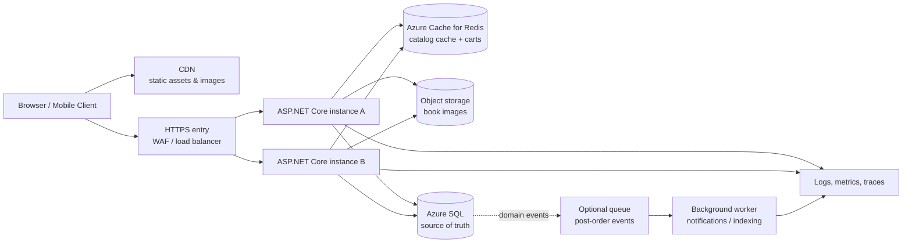
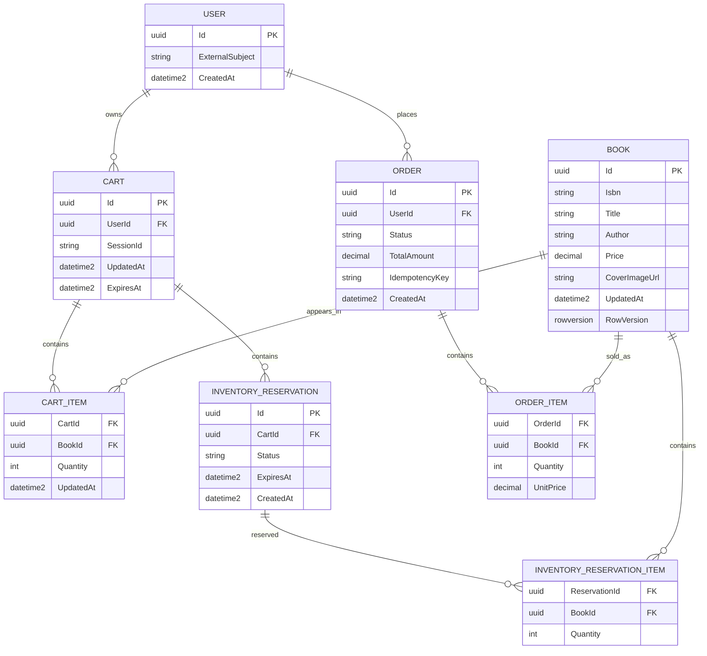
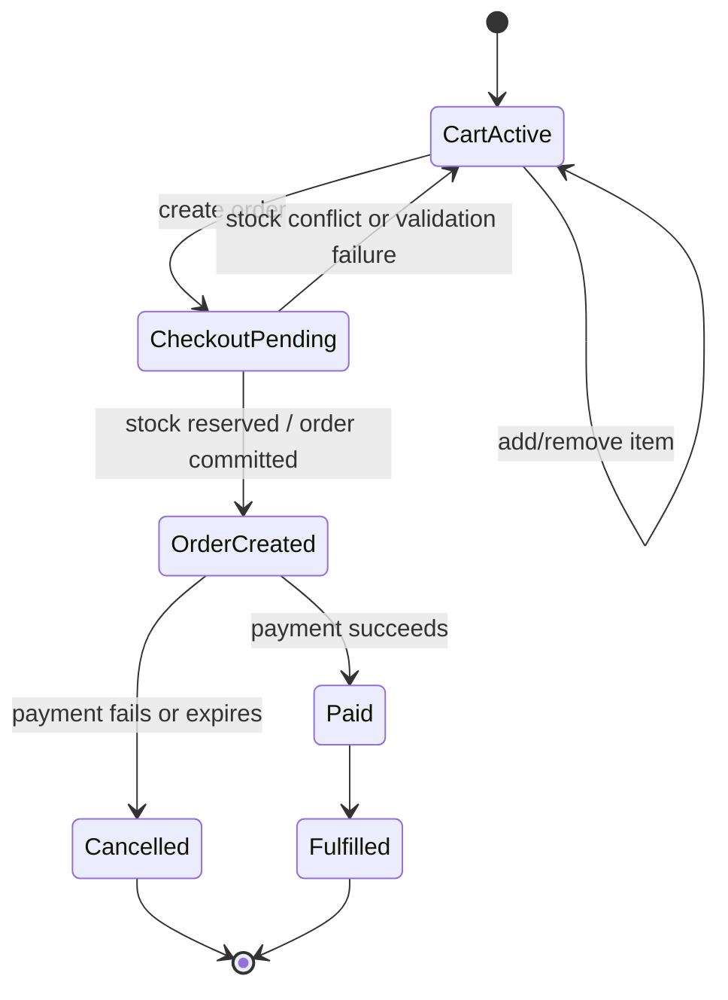

# ReadIt-App — Systems Design

**Status:** Proposed
**Audience:** Engineering, product, and operations teams
**Scope:** Evolve the current ASP.NET Core Razor Pages demo into a reliable, horizontally scalable book-catalog and shopping-cart application.

## 1. Executive summary

ReadIt-App is currently a single-process ASP.NET Core Razor Pages application using EF Core and an in-memory database. That architecture is appropriate for learning and local demos, but it cannot safely support production traffic because data is not durable or shared between instances, cart state is not user-scoped, and inventory updates are vulnerable to concurrent writes.

The recommended design is a **modular monolith first**:

- Keep one deployable ASP.NET Core application and one codebase.
- Move the system of record to Azure SQL.
- Make request handling and database access asynchronous.
- Store cart state in Redis, keyed by authenticated user or anonymous session.
- Add optimistic concurrency and an atomic inventory reservation operation.
- Add a cache-aside layer for the read-heavy catalog.
- Put static assets and book images behind a CDN.
- Make application instances stateless so they can scale horizontally.
- Introduce a versioned API boundary internally, even while Razor Pages remains the first client.

This approach addresses the current risks without prematurely introducing independently deployed microservices. Services can be extracted later if scale or team boundaries justify it.

## 2. Goals and non-goals

### Goals

1. Persist catalog and inventory data across restarts and deployments.
2. Allow multiple application instances behind a load balancer.
3. Ensure a cart belongs to the correct user or anonymous browser session.
4. Prevent overselling when multiple requests target the same book.
5. Keep catalog reads fast and inexpensive.
6. Support Razor Pages now and mobile/SPA clients later.
7. Provide a safe migration path from the existing demo implementation.
8. Make failures observable and recoverable.

### Non-goals for the first production phase

- Full marketplace capabilities such as sellers, commissions, or fulfillment networks.
- A microservice decomposition of catalog, cart, and order domains.
- Real-time inventory updates to every browser.
- Payment processing — should be integrated as a separate, explicitly scoped workflow once ordering is defined.
- Multi-region active-active writes.

## 3. Requirements and quality attributes

| Area | Requirement / target |
|---|---|
| Availability | Target 99.9% for catalog browsing; cart and checkout paths should fail gracefully when dependencies are degraded. |
| Scalability | Scale web instances horizontally without sticky sessions. |
| Consistency | Azure SQL is authoritative for catalog, inventory, and orders. Redis is never the source of truth for stock. |
| Performance | Cached catalog requests should normally complete within 200 ms at the application edge; uncached reads within 500 ms. |
| Durability | No catalog, inventory, or order data is lost on an application restart. |
| Concurrency | Inventory cannot become negative; concurrent reservations must be serialized or rejected safely. |
| Security | HTTPS, authenticated user isolation, anti-forgery protection, secret management, least-privilege database access. |
| Operability | Structured logs, metrics, traces, health checks, alerts, backups, migration visibility. |
| Maintainability | Preserve a modular monolith boundary; avoid embedding business rules in Razor Page handlers. |

> The latency targets are initial engineering objectives, not contractual SLAs — validate with production-like load testing.

## 4. Proposed architecture



### Component responsibilities

| Component | Responsibility |
|---|---|
| CDN | Serve versioned CSS, JavaScript, and book images close to users. |
| WAF / load balancer | TLS termination, routing, health-based instance selection, basic abuse protection. |
| ASP.NET Core web application | Authentication, Razor Pages, API endpoints, application orchestration, validation, authorization. |
| Catalog module | Book search/list/detail operations, catalog cache invalidation, admin catalog changes. |
| Cart module | Per-user/per-session cart reads and writes in Redis; never directly changes authoritative stock. |
| Inventory module | Atomic stock checks and reservations in Azure SQL; owns concurrency rules. |
| Order module | Durable order and order-line records; consumes a reservation and defines order lifecycle. |
| Azure SQL | Durable system of record for books, inventory, users, carts-as-needed, reservations, and orders. |
| Redis | Short-lived catalog cache and cart state. Redis loss must not corrupt inventory or orders. |
| Object storage | Book cover images and other binary assets; database stores metadata and URLs only. |
| Background worker / queue | Non-critical asynchronous work such as email, search indexing, cache warming, analytics events. |

## 5. Application structure

The application should remain a single deployable unit initially, but use explicit module boundaries:

```
src/
  ReadIt.Web/
    Features/
      Catalog/
        CatalogEndpoints.cs
        CatalogService.cs
        CatalogRepository.cs
        CatalogModels.cs
      Cart/
        CartEndpoints.cs
        CartService.cs
        CartStore.cs
      Inventory/
        InventoryService.cs
        InventoryRepository.cs
      Orders/
        OrderService.cs
        OrderRepository.cs
    Data/
      BookContext.cs
      Migrations/
    Infrastructure/
      Redis/
      Messaging/
      Observability/
      Storage/
    Pages/
    Program.cs
```

Razor Page handlers and API controllers should be thin. They validate input, identify the caller, invoke an application service, and map the result to HTML or JSON. Business invariants such as "stock must not become negative" belong in the Inventory module and the database transaction, not in page code.

## 6. Data model

### Core relational tables



### Inventory representation

For the first production version, `Book` may retain `InStock`, but inventory behavior should be modeled explicitly in the Inventory module. A later refinement can move it to a separate `Inventory` table if inventory becomes warehouse- or location-specific.

Recommended fields:

- `InStock int NOT NULL CHECK (InStock >= 0)`
- `RowVersion rowversion NOT NULL` for optimistic concurrency
- `UpdatedAt datetime2 NOT NULL`
- Optional `ReservedQuantity int NOT NULL` if the product introduces a reservation window

Prices must be copied into `OrderItem.UnitPrice` when an order is created. Historical orders must not change when the catalog price changes.

## 7. Critical request flows

### 7.1 View catalog

1. Client requests `GET /api/v1/books` or the Razor Page equivalent.
2. The application validates pagination, sorting, and search parameters.
3. It checks Redis using a versioned key such as `catalog:books:v1:{queryHash}`.
4. On a cache hit, it returns the cached DTO.
5. On a miss, it queries Azure SQL with a bounded projection and `AsNoTracking()`.
6. It writes the result to Redis with a short TTL and returns it.
7. Catalog mutations publish an invalidation event or delete affected keys.

The cache should contain DTOs, not EF entities. Cache keys must include all query parameters that affect the response.

### 7.2 Add item to cart

1. Client sends `POST /api/v1/cart/items` with `{ bookId, quantity }`.
2. The application authenticates the user or resolves a cryptographically random anonymous session ID.
3. It validates that the requested quantity is positive and within a configured maximum.
4. It verifies the book exists and is purchasable.
5. It updates the user/session cart in Redis using an atomic operation or optimistic retry.
6. It returns the normalized cart.

Adding to a cart should not permanently decrement inventory. Stock should be reserved at checkout, or at add-to-cart only if the product explicitly requires reservations with expiry.

### 7.3 Checkout and reserve inventory

1. Client sends `POST /api/v1/orders` with an idempotency key.
2. The application loads the cart and validates its contents.
3. In one SQL transaction, it attempts an atomic decrement for each line:

   ```sql
   UPDATE Books
   SET InStock = InStock - @quantity,
       UpdatedAt = SYSUTCDATETIME()
   WHERE Id = @bookId
     AND InStock >= @quantity;
   ```

4. If any update affects zero rows, the transaction rolls back and the client receives `409 Conflict` with the unavailable items.
5. If all updates succeed, the application inserts the order and order lines using the current prices.
6. The idempotency record is committed with the order.
7. The cart is cleared only after the transaction succeeds.
8. Non-critical work — email, analytics, search updates — is emitted through an outbox or queue after commit.

If a payment provider is added later, avoid holding a SQL transaction open while waiting on the provider. Use an order state machine such as `PendingPayment -> Paid -> Fulfilled` and compensate by releasing reservations when payment expires or fails.

### 7.4 Seed or import catalog data

Seeding must be removed from the public browsing UI. It should be an authenticated administrative command or a deployment job that is:

- idempotent
- protected by authorization
- auditable
- performed in batches
- followed by cache invalidation
- safe to retry

## 8. Concurrency and consistency design

### Inventory

The database is the authority. Do not implement inventory decrement as "read entity, decrement property, save" without a concurrency guard. Preferred options, in order:

1. Atomic conditional update as shown above, with a transaction around order creation.
2. EF Core optimistic concurrency using `RowVersion`, with bounded retries for safe operations.
3. A reservation table and expiration process if checkout spans a meaningful period.

The application must treat zero affected rows as a business conflict, not as a generic server error.

### Cart

Use a key such as:

```
cart:user:{userId}
cart:session:{sessionId}
```

When an anonymous user signs in, merge the session cart into the user cart with deterministic quantity rules and a maximum line/quantity limit. Never use a global key such as `cart`.

Redis cart writes should use a Lua script, transaction, or compare-and-set strategy so two simultaneous browser requests do not silently overwrite each other. Cart TTL should be long enough for normal shopping behavior and refreshed on activity.

### Cache

Redis is disposable. If Redis is unavailable:

- catalog reads should fall back to Azure SQL with rate limiting;
- cart operations should return a controlled dependency-unavailable response rather than inventing a cart state;
- inventory and orders must continue to use SQL directly.

Use cache-aside with TTL and explicit invalidation after catalog writes. Add jitter to TTLs to avoid mass expiry.

## 9. API boundary

The first client can remain Razor Pages, but shared operations should be exposed through versioned application endpoints.

| Method | Endpoint | Purpose | Success | Important errors |
|---|---|---|---|---|
| GET | `/api/v1/books` | Paginated catalog search | 200 | 400 invalid query |
| GET | `/api/v1/books/{id}` | Book details | 200 | 404 not found |
| GET | `/api/v1/cart` | Get current cart | 200 | 401 if auth required |
| POST | `/api/v1/cart/items` | Add/update cart item | 200 | 400, 404, 409 |
| DELETE | `/api/v1/cart/items/{bookId}` | Remove cart item | 204 | 404 |
| POST | `/api/v1/orders` | Create order from cart | 201 | 400, 409, 422 |
| GET | `/api/v1/orders/{id}` | Get own order | 200 | 403, 404 |
| POST | `/api/v1/admin/catalog/import` | Protected catalog import | 202 | 401, 403, 409 |

Use standard `ProblemDetails` responses. Require an `Idempotency-Key` header for order creation and persist the result against the authenticated user plus key. Do not expose EF entities directly from the API.

## 10. Security and privacy

- Enforce HTTPS and secure, HTTP-only cookies.
- Use the framework anti-forgery mechanism for state-changing Razor forms.
- Require authorization for carts, orders, and admin/import operations.
- Ensure every order lookup is scoped to the current user unless the caller has an admin role.
- Use a random, non-guessable anonymous session identifier; do not put personal data in the Redis key.
- Store SQL, Redis, signing, and storage credentials in a managed secret store, not source control or app settings committed to Git.
- Use managed identities where available and least-privilege database roles.
- Validate and cap quantities, page sizes, search lengths, and request bodies.
- Apply rate limits to login, catalog search, cart mutation, checkout, and admin endpoints.
- Treat book cover uploads as untrusted: validate type and size, strip metadata where appropriate, scan uploads, serve from a separate asset domain or storage container.
- Log security-relevant events without logging tokens, passwords, session IDs, or full payment details.

## 11. Reliability and operations

### Health checks

Expose separate checks:

- `/health/live` — process is running; no dependency calls.
- `/health/ready` — application can serve traffic; checks Azure SQL and, where required, Redis.
- Dependency health should be visible in metrics even when a degraded dependency does not make the whole app unready.

### Observability

Emit structured logs with a correlation/request ID and fields such as route, status code, duration, user hash, and dependency latency. Add distributed traces for SQL and Redis calls.

Recommended metrics:

- request count, error rate, and latency by route
- SQL query duration and connection pool saturation
- Redis hit ratio, latency, evictions, and errors
- cart mutation conflicts
- inventory reservation success/conflict rate
- order creation rate and idempotency replays
- queue depth and dead-letter count
- cache invalidation failures

Alert on elevated 5xx responses, SQL/Redis unavailability, sustained latency, low cache hit rate, negative inventory invariant violations, and queue backlog.

### Backups and recovery

- Enable Azure SQL point-in-time restore and test restoration regularly.
- Define an RPO/RTO before production launch. A reasonable initial target is RPO ≤ 15 minutes and RTO ≤ 1 hour for the primary region.
- Redis should be treated as reconstructable; do not rely on it for durable orders or inventory.
- Keep database migrations forward-compatible and deploy schema changes before code that requires them.

## 12. Deployment topology

A practical Azure deployment could use:

- Azure Front Door or Application Gateway with WAF
- Azure App Service or Container Apps running at least two web instances
- Azure SQL Database with automated backups
- Azure Cache for Redis
- Azure Blob Storage plus CDN for images and static assets
- Application Insights / OpenTelemetry-compatible monitoring
- Managed identity and Key Vault for secrets

The exact hosting product is less important than the properties: shared durable storage, stateless web instances, health-based routing, managed secrets, and observable dependencies.

Use blue/green or rolling deployment only after readiness checks are reliable. Enable SQL migrations through a controlled deployment step, not on every web instance startup in production.

## 13. Migration plan

**Phase 1 — Stabilize the codebase**
- Add automated tests around catalog, cart, and inventory behavior.
- Convert EF Core calls to async APIs.
- Move business logic out of `IndexModel` and `BookLoader` into services.
- Add DTOs, validation, structured logging, and health checks.
- Remove the public seed action or protect it behind admin authorization.

**Phase 2 — Move to durable shared storage**
- Provision Azure SQL and configure a non-production environment.
- Add migrations and a deployment-time migration process.
- Import seed data using an idempotent admin/import job.
- Add the `InStock >= 0` constraint and `RowVersion` column.
- Run migration validation and backup/restore tests.

**Phase 3 — Implement user-scoped carts**
- Add authentication or an anonymous session abstraction.
- Implement Redis keys per user/session.
- Add cart merge behavior on sign-in.
- Add TTLs, limits, atomic cart updates, and Redis failure handling.

**Phase 4 — Make inventory safe**
- Implement atomic conditional stock updates.
- Add an order transaction and idempotency keys.
- Return `409 Conflict` for stock contention.
- Load-test concurrent checkout attempts against the same book.

**Phase 5 — Scale reads and delivery**
- Add catalog cache-aside behavior and invalidation.
- Move images/static assets to object storage and CDN.
- Add at least two stateless application instances behind a load balancer.
- Verify readiness routing, cache behavior, and session independence.

**Phase 6 — Add asynchronous extensions only when needed**
- Introduce an outbox and queue for email, indexing, and analytics.
- Add a background worker.
- Extract a service only when independent scaling, ownership, or release cadence justifies the operational cost.

## 14. Testing strategy

| Test type | Coverage |
|---|---|
| Unit | Cart merge rules, quantity validation, price calculation, state transitions. |
| Integration | EF Core queries, SQL constraints, atomic stock decrement, Redis serialization and TTLs. |
| Contract | API request/response schemas and `ProblemDetails` behavior. |
| End-to-end | Browse, add/remove cart item, sign-in merge, checkout, authorization boundaries. |
| Concurrency | Many simultaneous checkouts for the same book; prove stock never becomes negative. |
| Resilience | Redis outage, SQL transient errors, queue retries, duplicate idempotency keys. |
| Load | Read-heavy catalog traffic, cache hit ratio, checkout contention, multi-instance behavior. |
| Security | CSRF, IDOR/order access, rate limits, upload validation, secret exposure checks. |
| Recovery | Restore Azure SQL backup and rebuild Redis from durable state. |

A production readiness gate should require passing integration and concurrency tests; unit-test coverage alone is not sufficient for the inventory risks in this system.

## 15. Key decisions and alternatives

**Modular monolith vs. microservices**
*Decision:* Start with a modular monolith.
*Reason:* Reduces deployment and operational complexity while creating clear boundaries for later extraction. The current scale and domain size do not justify network calls between catalog, cart, and inventory services.

**SQL vs. Redis as inventory source**
*Decision:* Azure SQL is authoritative.
*Reason:* Inventory and orders need transactions, constraints, durability, and queryability. Redis remains useful for speed and ephemeral cart state.

**Reservation timing**
*Decision:* Do not decrement stock when merely adding to cart. Reserve at checkout unless product requirements demand a time-limited reservation.
*Reason:* Cart abandonment would otherwise lock inventory. If reservations are required, use explicit reservation records with expiry and a recovery job.

**Read replicas**
*Decision:* Defer read replicas until measured SQL read pressure requires them.
*Reason:* Catalog caching and indexed queries should address the initial read load. Replicas introduce replication lag and routing complexity; writes and consistency-sensitive reads remain on the primary.

## 16. Risks and mitigations

| Risk | Mitigation |
|---|---|
| Redis outage loses active carts | Treat cart as recoverable, show controlled errors, optionally persist carts for authenticated users later. |
| Cache serves stale catalog data | Short TTLs, versioned keys, invalidation after writes, explicit freshness policy. |
| Checkout retries create duplicate orders | Require and persist idempotency keys. |
| Concurrent stock updates oversell | Atomic conditional SQL update plus non-negative constraint and concurrency tests. |
| Long-running payment flow holds locks | Use an order state machine and expiring reservations, not a transaction across external calls. |
| Premature microservices increase failure modes | Keep one deployable unit until scale/team boundaries prove extraction is worthwhile. |
| Public seed endpoint corrupts production data | Remove it from public UI and protect imports with admin authorization and audit logs. |

## 17. Definition of done for production readiness

ReadIt-App is ready for an initial production launch when:

- all catalog and order data is stored in Azure SQL;
- no production request depends on process-local memory for correctness;
- two or more app instances can serve the same traffic without sticky sessions;
- carts are isolated by user/session;
- concurrent checkout cannot produce negative stock;
- order creation is idempotent;
- migrations, backups, restore procedures, health checks, logs, and alerts are documented and tested;
- admin import/seed operations are protected and auditable;
- load, failure, authorization, and recovery tests pass in a production-like environment.

## 18. Recommended immediate next steps

1. Create application-service interfaces for Catalog, Cart, Inventory, and Orders.
2. Convert `BookContext` calls to async and add cancellation tokens.
3. Provision a development Azure SQL database and run the first migration.
4. Add `RowVersion`, a non-negative stock constraint, and an atomic decrement repository method.
5. Implement user/session-scoped Redis carts with integration tests.
6. Add `POST /api/v1/orders` with SQL transaction and idempotency behavior.
7. Add health checks, structured logging, and a basic load test before enabling multiple instances.
8. Add catalog caching and CDN delivery after correctness is established.

## Appendix A — Order state transitions



## Appendix B — Summary of current-to-target changes

| Current | Target |
|---|---|
| In-memory EF database | Azure SQL system of record |
| Synchronous queries | Async EF Core with cancellation |
| One global/dormant Redis cart | User/session-scoped Redis cart |
| Stock decrement in page handler | Inventory service + atomic SQL transaction |
| No cache | Cache-aside catalog cache with invalidation |
| One process | Stateless multi-instance web tier |
| Local/static asset serving | Object storage and CDN |
| Public/manual seed action | Protected, idempotent import job |
| Tight Razor Page coupling | Thin pages over modular application services |
| No operational contract | Health checks, metrics, logs, traces, backups, and alerts |
